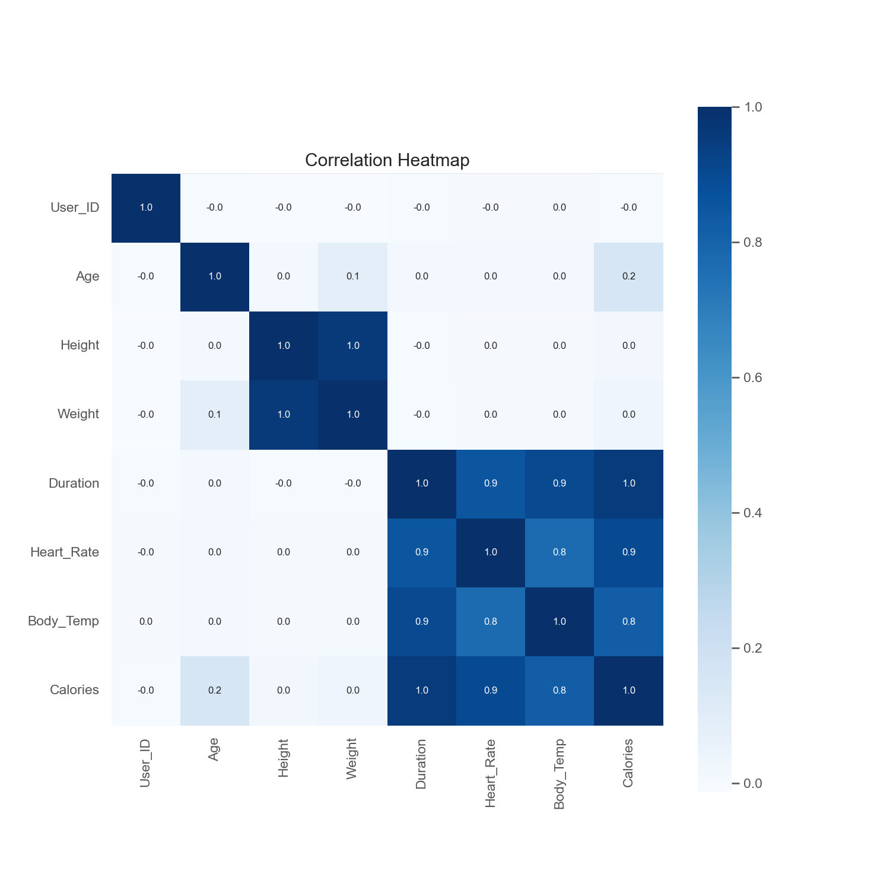
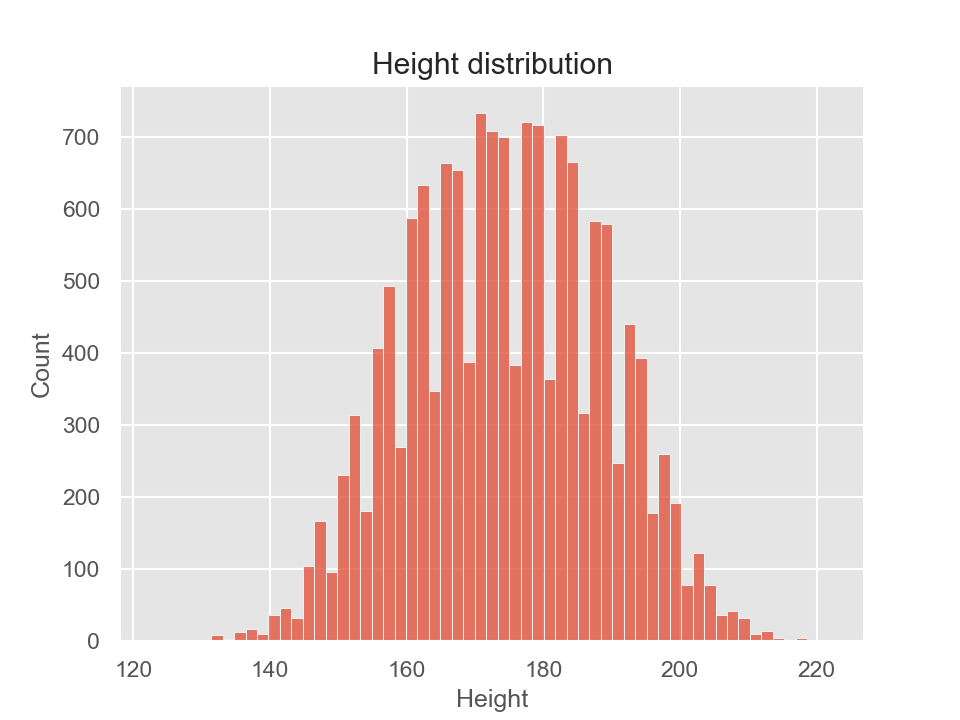
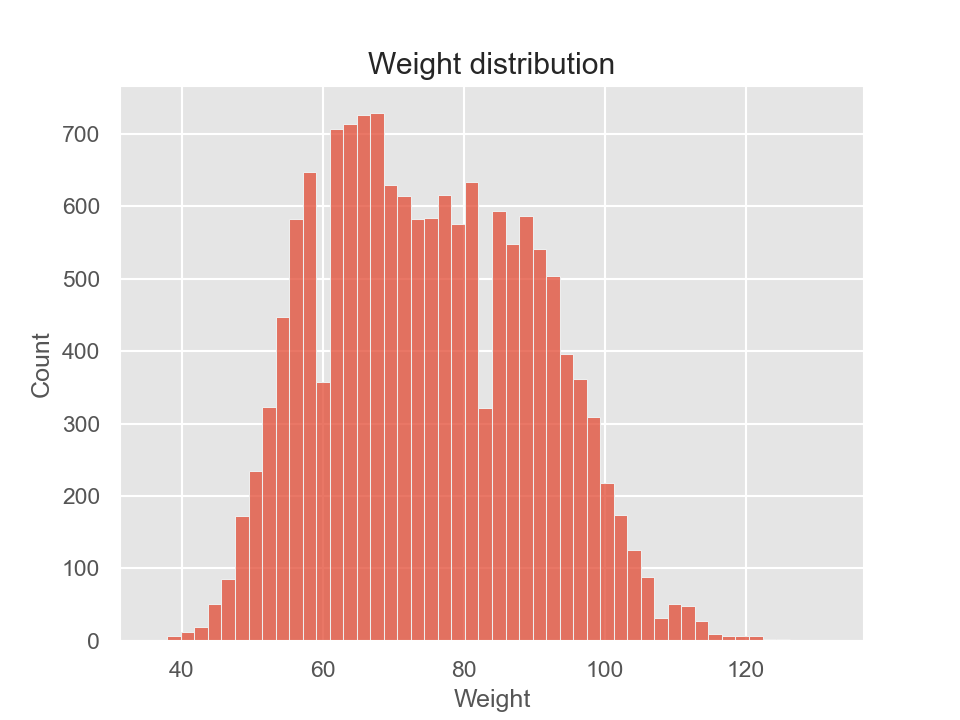
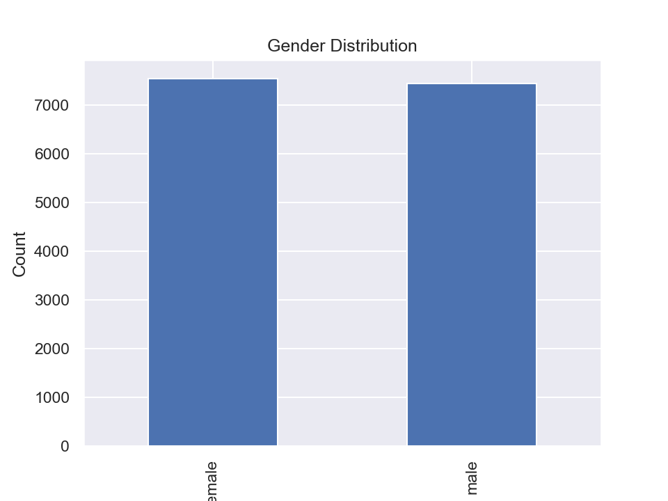

# Building a Calories Burn Predictor with XGBoost and Python

## Table of Contents
- [Overview](#overview)
- [Project Description](#project-description)
- [Installation](#installation)
- [Usage](#usage)
- [Data](#data)
- [Methodology](#methodology)
- [Results](#results)
- [Contributing](#contributing)

## Overview
This project aims to build a Calories Burn Predictor using XGBoost, a powerful machine learning algorithm. By analyzing fitness data and applying XGBoost regression, the model can predict the number of calories burned during various exercises.


## Project Description
In this project, we use Python along with the pandas, numpy, matplotlib, seaborn, and scikit-learn libraries to perform data manipulation, visualization, and model training. The XGBoost library is utilized to create a robust predictive model for estimating calories burned.

## Installation
To run this project locally, follow these steps:

1. Clone the repository:

```bash
git clone https://github.com/umairrrkhan/Building a Calories Burn Predictor with XGBoost and Python.git
cd calories-burn-predictor
```
- Install the required dependencies:
```bash
pip install pandas numpy matplotlib seaborn xgboost scikit-learn
```
## Usage
To use the Calories Burn Predictor, follow these instructions:

1. Ensure you have Python and the required libraries installed (see Installation section).
2. Prepare your fitness data in a CSV format with features like exercise duration, heart rate, age, etc.
3. Run the `Building a Calories Burn Predictor with XGBoost and Python.ipynb` Jupyter Notebook to train the XGBoost model on your dataset.
4. Use the trained model to predict calories burned for new exercise data.

## Data
The dataset used for training and testing the model can be found in the `data/` directory. The `calories.csv`   ,     `exercise.csv` file contains fitness data, including exercise details and the corresponding calories burned.


## Methodology
We employed the XGBoost algorithm, which is a popular gradient boosting technique, to build the Calories Burn Predictor. The data is preprocessed to handle missing values and converted into a suitable format for XGBoost. The model is trained on a portion of the dataset using the `train_test_split` function for evaluation.









## Results
The performance of the Calories Burn Predictor is evaluated using various metrics like Mean Absolute Error (MAE) and Root Mean Squared Error (RMSE). The predictions are compared against the ground truth values to assess the model's accuracy.

## Contributing
We welcome contributions to improve this project. If you find any issues or want to suggest enhancements, please create a pull request or submit an issue in the GitHub repository.


---
Built with ❤️ and XGBoost


 
